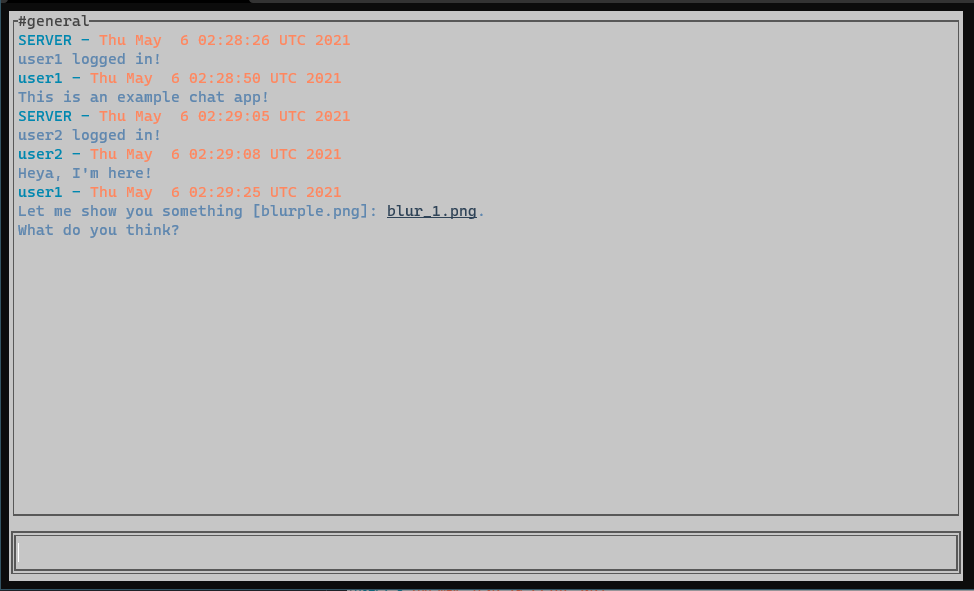

# gocha (go chat)

`gocha` is a real-time chat client and server implemented in Go using gRPC and Protobuf. It utilizes bi-directional streams to carry messages and files.



## Usage

Start the server

```console
go run server/server.go
```

Start a client

```console
go run client/* username
```

## Project Background

I had wanted to work with technologies like gRPC or GraphQL since my last project [**Paperboy**](https://github.com/algao1/paperboy-back), but never got the chance to.

With this project (inspired by [**6cord**](https://github.com/diamondburned/6cord)), I wanted to familiarize myself with gRPC and Protobuf, so I decided to create a simple chat client/server. For now, it supports basic functionalities like:

* Reading and writing messages
* Rudimentary styling of messages
* Image (png/jpeg) transfer

## Next Steps

There are some things I would like to revisit in decreasing priority:

* Refactor the code
* Add more formats for file transfer
* Add more styling (markdown-like)